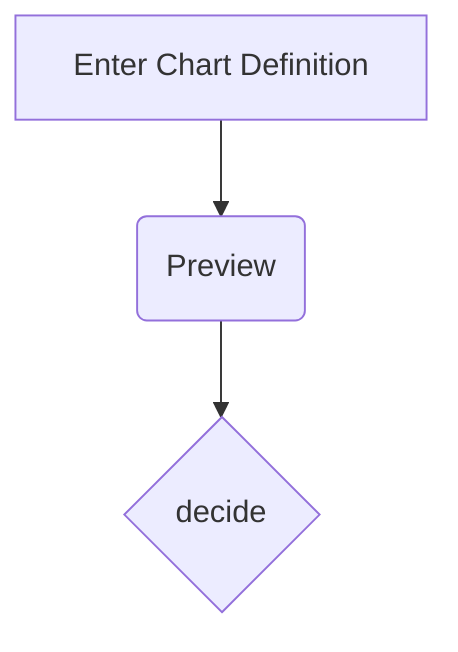

# Introduction

### Objectif de la formation

- Comprendre les bases de Git et GitHub.
- Différencier Git de GitHub.

---

# Git vs GitHub

### Git

- Système de contrôle de version décentralisé.
- Gestion des versions de code en local. 
- https://git-scm.com/

##

### GitHub

- Plateforme de gestion de projet utilisant Git.
- Collaboration, suivi des problèmes, intégration continue.
- https://github.com/

---

# Workflow


---

# Commandes Git de base

### git status

Vérifie l'état des fichiers dans le répertoire de travail.
##

### git add

Ajoute des fichiers à l'index pour le prochain commit.
##
### git commit

Enregistre les modifications dans le référentiel.
##
### git push

Pousse les modifications vers le référentiel distant.

---

# GitHub Actions

### Qu'est-ce que GitHub Actions ?

- Automatisation des workflows.
- Exécution d'actions sur des événements spécifiques.
##
### Configuration CI/CD

- Intégration continue et déploiement continu.

---

# Déploiement sur Azure Static Web Apps

### GitHub Repository

- Création d'un nouveau référentiel sur GitHub.
##
### Configuration de l'Action

- Fichier YAML pour définir le flux de travail.
##
### Déploiement sur Azure Static Web Apps

- Configuration simple.
- Utilisation de GitHub Actions pour déployer automatiquement.

---

# Pour la documentation
##
### Astro

Le framework utilisé pour générer la documentation est Astro :
https://astro.build/

##
### Markdown

Le langage le plus utilisé pour les documentations est le Markdown. Astro et GitHub utilisent également
ce langage : https://docs.github.com/fr/get-started/writing-on-github/getting-started-with-writing-and-formatting-on-github/basic-writing-and-formatting-syntax

##
### Mermaid

Pour les graphiques, GitHub et Astro utilisent Mermaid directement dans le Markdown. Cela permet de générer des diagrammes à partir de texte : https://mermaid.js.org/intro/getting-started.html

---

# Mermaid

##
### Code
```
graph TD
    A[Enter Chart Definition] --> B(Preview)
    B --> C{decide}
```

##
### Resultat



---

# Conclusion

Récapitulation des points clés :

- Différence entre Git et GitHub.
- Commandes Git de base.
- Introduction à GitHub Actions.
- Exemple concret avec déploiement sur Azure Static Web Apps.

---

# Questions ?

Avez-vous des questions ou des préoccupations ? Discutons-en !